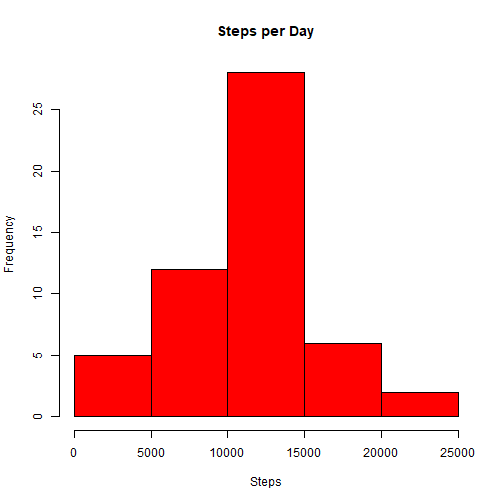
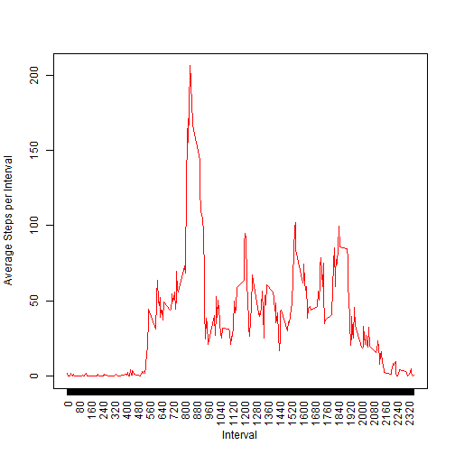
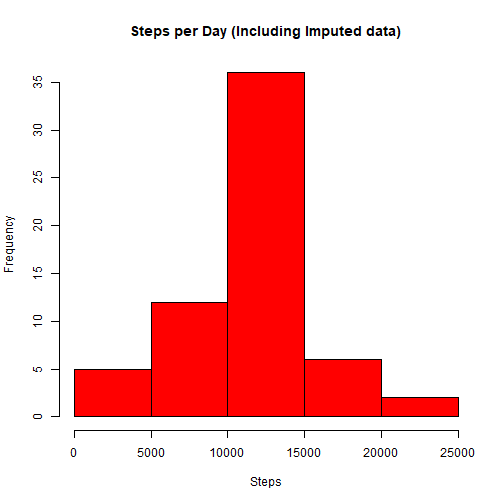
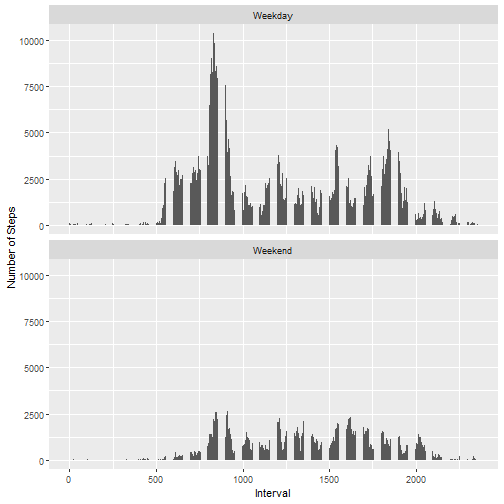

===========================================================================================

## Loading and preprocessing the data


```r
## Check if the file already exists under the working directory, if not, download and unzip it.
unzipped_file<- "activity.csv"

if (!file.exists(unzipped_file)) {
  
  fileurl <- "https://d396qusza40orc.cloudfront.net/repdata%2Fdata%2Factivity.zip"
  destfile <- "activity.zip"
  download.file(fileurl,destfile)
  outDir <- getwd()
  zipF<- "activity.zip"
  unzip(zipF,exdir=outDir)
}
## Read the CSV file
data <- read.csv("activity.csv")

## Convert Date column to date
data$date <- as.Date(data$date, format="%Y-%m-%d")
```

## What is mean total number of steps taken per day?

```r
## Include required libraries
library(dplyr)

## Calculate the total, mean and median steps per day
summary_per_day <- data %>% select(steps, date) %>% group_by(date) %>% 
                   summarise(MeanSteps = mean(steps,na.rm=TRUE),
                             Steps = sum(steps))

## Create a new histogram displaying Steps per Day
hist(summary_per_day$Steps,xlab="Steps",main="Steps per Day",col="red")
```



```r
## Calculate the median and mean steps per day
meanperday <- round(mean(summary_per_day$Steps,na.rm=TRUE),digits=0)
medianperday <- round(median(summary_per_day$Steps,na.rm=TRUE),digits=0)
```

The mean number of steps per day is 1.0766 &times; 10<sup>4</sup> and the median steps per day 
is 1.0765 &times; 10<sup>4</sup>.


## What is the average daily activity pattern?


```r
## Calculate the total steps per day
summary_per_interval <- data %>% select(steps, interval) %>% group_by(interval) %>% 
    summarise(MeanSteps = mean(steps,na.rm=TRUE),Steps = sum(steps,na.rm=TRUE))

## Create a new plot displaying Average Steps per Interval 
plot(summary_per_interval$interval, summary_per_interval$MeanSteps, type="l", 
     col="red", xlab="Interval", ylab="Average Steps per Interval", xaxt="n")
axis(1, at = seq(0,2355, by = 5), las=2)
```



```r
## Find the interval that has the maximum steps
maximum_steps <- summary_per_interval  %>% slice(which.max(Steps))
```

The 5-minute interval, on average across all the days in the data set that contains  
the maximum number of steps is 835.

## Imputing missing values


```r
## Calculate the number of rows where missing values exist
number_of_rows_with_na <- nrow(which(is.na(data), arr.ind=TRUE))
```

The number of rows that contain missing values are: 2304.


```r
## Create a new data set where missing values are set to the mean number of steps 
## of the corresponding date
## Step 1 identify missing data records
na_data <-  data[is.na(data),c(1:3)]

## Step 2: Merge the records with missing data with the already available mean per 
## day data
na_data_meanday <- merge(na_data, summary_per_day, by.x="date", by.y="date")

## Step 3: Merge the records with missing data with the already available mean per 
## interval data
na_data_full <- merge(na_data_meanday, summary_per_interval, by.x="interval", 
                      by.y="interval")

## Step 4: Replace NA value with either mean per day or per interval 
## (whichever is available)
na_data_full$steps <- ifelse(is.na(na_data_full$MeanSteps.x), 
                             na_data_full$MeanSteps.y,
                             na_data_full$MeanSteps.x)

## Step 5: Create a new data set containing the records with values and the 
## imputed data
imputed_data <- rbind(na_data_full[,c(1:3)], data[!is.na(data$steps),c(1:3)])


## Calculate the total, mean and median steps per day of the imputed data
summary_per_day_imputed<- imputed_data %>% select(steps, date) %>% 
                          group_by(date) %>% 
                          summarise(MeanSteps = mean(steps), 
                                    Steps = sum(steps), 
                                    MedianSteps = median(steps))

## Create a new histogram displaying Steps per Day including Imputed data
hist(summary_per_day_imputed$Steps,xlab="Steps",
     main="Steps per Day (Including Imputed data)",col="red")
```



```r
## Calculate the median and mean steps per day based on the imputed data
meanperday_imputed <- round(mean(summary_per_day_imputed$Steps,na.rm=TRUE),digits=0)
medianperday_imputed <- round(median(summary_per_day_imputed$Steps,na.rm=TRUE),digits=0)
```

The mean imputed steps per day is 1.0766 &times; 10<sup>4</sup> 
and the median imputed steps per day is 1.0766 &times; 10<sup>4</sup>.


```r
## Check imputed values to see how they are compared to actual values
if(meanperday_imputed==meanperday)
    {means<-"Equal"}
    {if(meanperday_imputed<meanperday)
        {means<-"less than"}
        {means<-"greater than"}
    }


if(medianperday_imputed==medianperday)
    {medians<-"Equal"}
    {if(medianperday_imputed<medianperday)
        {medians<-"less than"}
        {medians<-"greater than"}
    }
```

The Imputed mean value is greater than the actual mean value.  
The Imputed median value is greater than the actual median value.

## Are there differences in activity patterns between weekdays and weekends?


```r
## Include required libraries
library(ggplot2)

## Create a new vector with days of the week
weekdays_list <- c("Monday","Tuesday","Wednesday","Thursday","Friday")

## Create a new variable in the imputed data to identify weekdays and weekends
imputed_data <- transform(imputed_data, weekend_indicator= 
                          ifelse(weekdays(date) %in% weekdays_list, "Weekday", "Weekend"))

## Summarize the data per interval and weekend_indicator
summary_per_interval_daytype<- imputed_data %>% select(steps, weekend_indicator, interval) %>% 
                               group_by(weekend_indicator, interval) %>% 
                               summarise(MeanSteps = mean(steps), 
                                         Steps = sum(steps), 
                                         MedianSteps = median(steps))

## Convert the new column to a factor
imputed_data$weekend_indicator<-as.factor(imputed_data$weekend_indicator)

## Plot data per weekend indicator and interval

qplot(interval,Steps, geom = "col",data=summary_per_interval_daytype)+
  facet_wrap( ~weekend_indicator,ncol=1,nrow=2)+
  labs(x ="Interval", y = "Number of Steps") 
```


